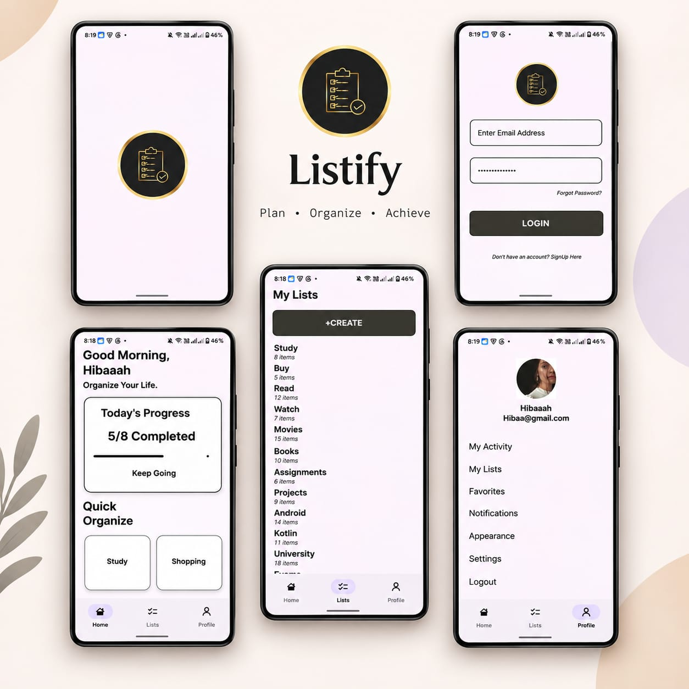
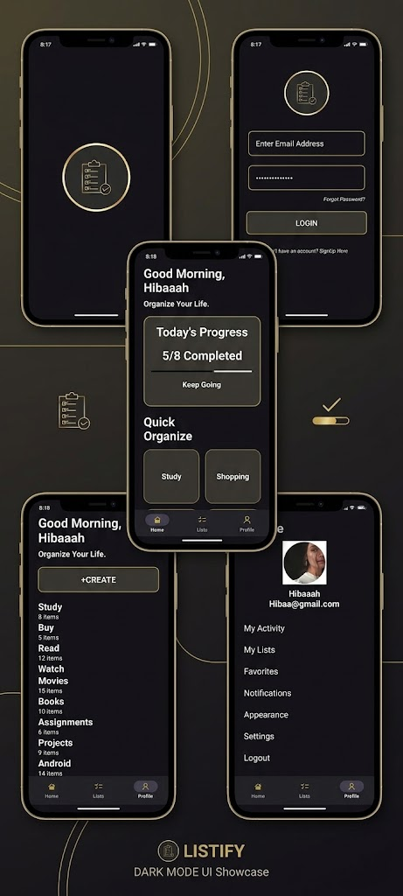

<div align="center">


# LISTIFY

### PLAN &nbsp;·&nbsp; ORGANIZE &nbsp;·&nbsp; ACHIEVE

*A clean, modern productivity app for organizing everyday tasks and lists — built natively for Android.*

<br/>


<br/>


<br/>


<br/><br/>

**[ Overview ](#overview)** &nbsp;&nbsp;|&nbsp;&nbsp;
**[ Features ](#features)** &nbsp;&nbsp;|&nbsp;&nbsp;
**[ Screenshots ](#screenshots)** &nbsp;&nbsp;|&nbsp;&nbsp;
**[ Tech Stack ](#tech-stack)** &nbsp;&nbsp;|&nbsp;&nbsp;
**[ Architecture ](#app-architecture)** &nbsp;&nbsp;|&nbsp;&nbsp;
**[ Getting Started ](#getting-started)** &nbsp;&nbsp;|&nbsp;&nbsp;
**[ Roadmap ](#roadmap)** &nbsp;&nbsp;|&nbsp;&nbsp;
**[ Developer ](#developer)**

</div>

<br/>

## Overview

**Listify** is a simple and user-friendly Android productivity app designed to help users organize their everyday tasks and lists in one place. Built with **Kotlin and XML** using modern Android development practices, Listify focuses on clean UI, intuitive navigation, and reusable components — with full support for both **Light** and **Dark** themes, styled around a signature **black, gold, and blush-cream** palette.

<br/>

## Features

<table width="100%">
<tr>
<td width="50%" valign="top">

### Home Screen
- Personalized greeting for the user
- Daily progress tracker with completion count
- Quick-access shortcuts to key list categories
- Study, Buy, Read, Watch, and custom list cards

</td>
<td width="50%" valign="top">

### Lists
- Organized, category-based list management
- RecyclerView-powered list presentation
- Reusable CardView components
- Item counts displayed per list

</td>
</tr>
<tr>
<td width="50%" valign="top">

### Profile
- Dedicated profile and account section
- RecyclerView-based settings menu
- Activity, Favorites, and Notifications access
- Clean, structured layout

</td>
<td width="50%" valign="top">

### Navigation
- Bottom Navigation across major sections
- Fragment-based screen architecture
- Smooth, consistent transitions between screens

</td>
</tr>
</table>

### Theming

<div align="center">

|  |  |
|:---:|:---:|
| Soft blush-cream palette with charcoal text | Deep charcoal palette with warm gold accents |
| Optimized for daytime use | Optimized for low-light environments |

</div>

<br/>

## Screenshots

<div align="center">

**Light Mode**



<br/><br/>

**Dark Mode**



</div>
<br/>

## Tech Stack

<div align="center">

| Technology | Purpose |
|---|---|
|  | Core application development |
|  | UI layout definitions |
|  | Development environment |
|  | UI component library |
|  | Version control |
|  | Source hosting & collaboration |

</div>

**Core Android components used:** RecyclerView · CardView · Fragments · BottomNavigationView · DrawerLayout · Custom Drawables

<br/>

## App Architecture

```
Listify
│
├── Home
│   ├── Greeting & Progress Tracker
│   ├── Study List
│   ├── Buy List
│   ├── Read List
│   ├── Watch List
│   └── Custom Lists
│
├── Lists
│   ├── List Overview (RecyclerView)
│   └── List Items
│
└── Profile
    ├── Account Info
    └── Settings & Preferences
```

<br/>

## Getting Started

<table width="100%">
<tr><td>

**1. Clone the repository**
```bash
git clone https://github.com/<your-username>/Listify.git
```

**2. Open in Android Studio**
```
File → Open → Select the cloned Listify folder
```

**3. Sync Gradle and run**
```
Build → Sync Project with Gradle Files
Run ▶ on an emulator or physical device
```

</td></tr>
</table>

<div align="center">

| Requirement | Version |
|---|---|
| Android Studio | Giraffe or newer |
| Minimum SDK | 21 (Android 5.0) |
| Kotlin | 1.9+ |
| Gradle | 8.0+ |

</div>

<br/>

## Concepts Practiced

This project also serves as a hands-on exploration of core Android development concepts:

- Activity and Fragment lifecycle management
- XML layout design and constraint-based UI
- RecyclerView with custom Adapters and ViewHolders
- CardView-based UI composition
- Fragment-based navigation
- Bottom Navigation and Navigation Drawer implementation
- Custom drawables and resource management
- Light/Dark theme resource switching
- Kotlin data classes
- Git branching and version control workflows

<br/>

## Project Goal

The goal of Listify is to build a practical, polished Android application while strengthening core Android development skills — and to understand how different UI components work together within a real, structured project.

<br/>

## Developer

<div align="center">


**Hibba Hanif**

Computer Science Student · Android Developer

<br/>

[](https://github.com/<h-hibaaah>)
[](mailto:hibba5825@gmail.com)

<br/>

*Built with Kotlin and XML*

</div>

---

<div align="center">

<sub>If you found this project useful, consider giving it a star.</sub>

<br/>


</div>
